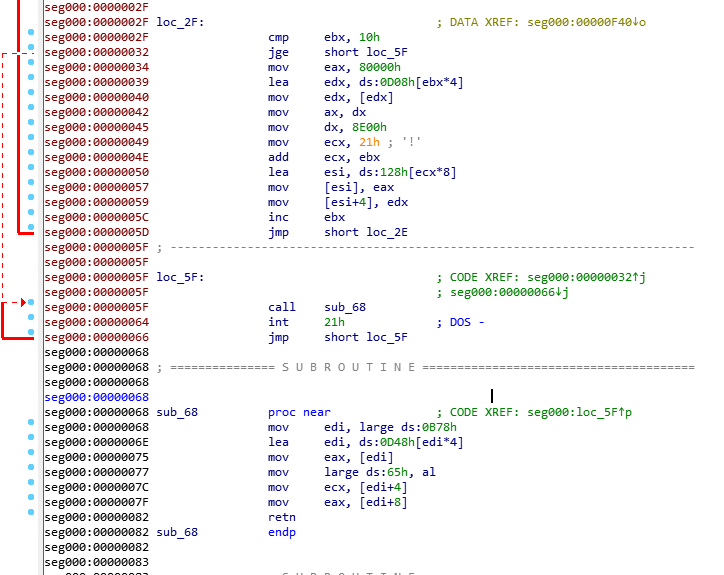
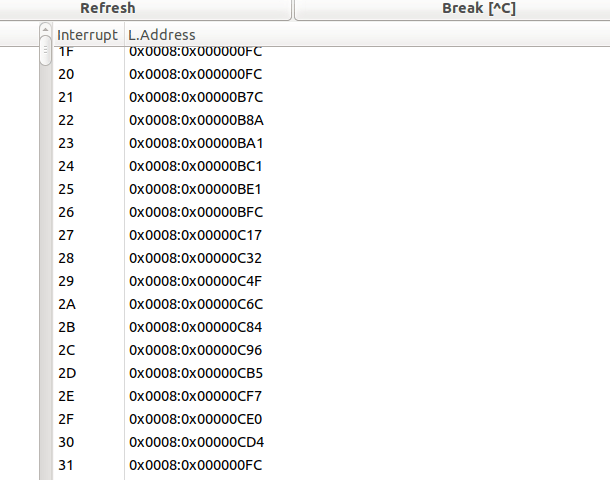
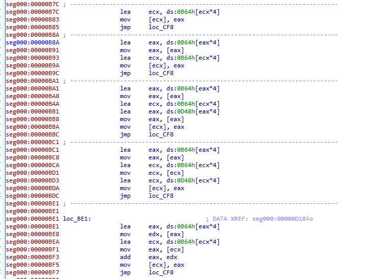

# strange_int

这题是一个裸机程序。前面512字节loder被BIOS读进内存，loader把后面的部分也读进内存，设置好IDT/GDT后，执行长跳转进入保护模式。观察GDT表的值，发现cs和ds都指向了0x00000000，所以可以把image.bin的头512字节切掉，拖进IDA分析。





同时使用bochs对程序进行调试。在调试过程中发现，每次运行到0x64时，中断号都会被改变。继续跟踪发现sub_68()会读取0x0d48[edi*4]处的值并据此修改中断号。在bochs中查看IDT：





再在IDA中查看中断向量表对应的地址：





发现这是个VM。sub_68()每次会读12个字节，第一个DWORD低8位对应指令码（即中断号），第二、三个DWORD是操作数，而内存0x0b64~0x0b77这5个DWORD是VM的寄存器，0x0b78处则是VM的程序计数器。当指令码为0X2f（输出"correct")或0x30(输出"wrong")时，程序结束。

写了个脚本把0x0d48开始（对应文件+0f48h）的内容dump出来，并对应汇编恢复出每条VM指令的行为：
(a=(DWORD\*)0x0b64, b=(DWORD\*)0x0d48)

```
int_num=0x21, ecx=0x0, eax=0x81  a[0]=0x81
int_num=0x27, ecx=0x1, eax=0x1   xor a[1],a[1]
int_num=0x24, ecx=0x1, eax=0x1   b[a[1]]=a[1]
int_num=0x23, ecx=0x2, eax=0x0   a[2]=b[a[0]]
int_num=0x22, ecx=0x3, eax=0x2   a[3]=a[2]
int_num=0x21, ecx=0x4, eax=0x8   mov a[4],0x8
int_num=0x28, ecx=0x3, eax=0x4   a[3]=a[3]<<(a[4]&0xff)
int_num=0x27, ecx=0x2, eax=0x3   xor a[2],a[3]
int_num=0x28, ecx=0x3, eax=0x4   a[3]=a[3]<<(a[4]&0xff)
int_num=0x27, ecx=0x2, eax=0x3   xor a[2],a[3]
int_num=0x28, ecx=0x3, eax=0x4   a[3]=a[3]<<(a[4]&0xff)
int_num=0x27, ecx=0x2, eax=0x3   xor a[2],a[3]
int_num=0x27, ecx=0x3, eax=0x3   xor a[3],a[3]
int_num=0x23, ecx=0x4, eax=0x3   mov a[4],b[a[3]]
int_num=0x24, ecx=0x3, eax=0x2   mov b[a[3]],a[2]
int_num=0x27, ecx=0x2, eax=0x4   xor a[2],a[4]
int_num=0x24, ecx=0x0, eax=0x2   mov b[a[0]],a[2]
int_num=0x21, ecx=0x1, eax=0x1   mov a[1],1
int_num=0x25, ecx=0x0, eax=0x1   add a[0],a[1]
int_num=0x22, ecx=0x1, eax=0x0   mov a[1],a[0]
int_num=0x21, ecx=0x2, eax=0x81  mov a[2],0x81
int_num=0x26, ecx=0x1, eax=0x2   sub a[1],a[2]
int_num=0x21, ecx=0x2, eax=0x9   mov a[2],9
int_num=0x26, ecx=0x1, eax=0x2   sub a[1],a[2]
int_num=0x21, ecx=0x2, eax=0x9   mov a[2],9
int_num=0x2d, ecx=0x2, eax=0x1   test a[1],a[1]; jnz a[2]
int_num=0x21, ecx=0x0, eax=0x81  a[0]=0x81
int_num=0x22, ecx=0x1, eax=0x0   mov a[1],a[0]
int_num=0x21, ecx=0x2, eax=0x9   mov a[2],9
int_num=0x25, ecx=0x1, eax=0x2   add a[1],a[2]
int_num=0x23, ecx=0x3, eax=0x0   a[3]=b[a[0]]
int_num=0x23, ecx=0x4, eax=0x1   a[4]=b[a[1]]
int_num=0x26, ecx=0x3, eax=0x4   sub a[3],a[4]
int_num=0x21, ecx=0x4, eax=0x7e  mov a[4],0x7e
int_num=0x2d, ecx=0x4, eax=0x3   test a[3],a[3]; jnz a[4]
int_num=0x21, ecx=0x3, eax=0x1   mov a[3],1
int_num=0x25, ecx=0x0, eax=0x3   add a[0],a[3]
int_num=0x25, ecx=0x1, eax=0x3   add a[1],a[3]
int_num=0x26, ecx=0x2, eax=0x3   sub a[2],a[3]
int_num=0x21, ecx=0x4, eax=0x5a  mov a[4],0x5a
int_num=0x2d, ecx=0x4, eax=0x2   test a[2],a[2]; jnz a[4]
int_num=0x2f, ecx=0x0, eax=0x0
int_num=0x30, ecx=0x0, eax=0x0
```

这段代码从内存0x0f4c（文件+114ch)读出36个字节，经过一系列运算，再与内存0x0f70（文件+1170h)的36个字节进行比较，若一致则输出correct。理解这段代码后，就可以用0x0f70处的值倒推出flag了：

```
c = [0x65, 0x55, 0x63, 0x57, 0x1, 0x4, 0x53, 0x6, 0x49, 0x49, 0x49, 0x1f, 0x1f, 0x7, 0x57, 0x51, 0x57, 0x43, 0x5f, 0x57, 0x57, 0x5e, 0x43, 0x57, 0xa, 0x2, 0x57, 0x43, 0x5e, 0x3, 0x5e, 0x57, 0x0, 0x0, 0x59, 0xf]
tmp = [0, 0, 0, 0]

for i in range(0, len(c), 4):
	for j in range(4):
		tm2 = c[i+j]
		c[i+j] = c[i+j] ^ tmp[j]
		tmp[j] = c[i+j]
	c[i+1] = c[i+1] ^ c[i]
	c[i+2] = c[i+2] ^ c[i+1] ^ c[i]
	c[i+3] = c[i+3] ^ c[i+2] ^ c[i+1] ^ c[i]

flag1 = ''
for i in range(len(c)):
	flag1 += chr(c[i])

print(flag1)
```


flag{e064d5aa-5a72-11e9-9200-88e9fe80feaf}
