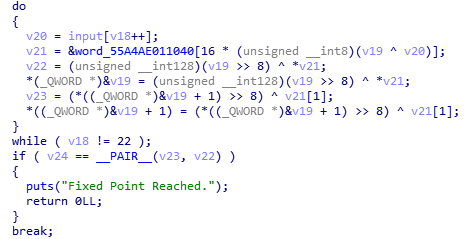
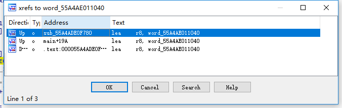

### fixed_point

fixed point

#### 分析

可执行文件只有10kB，说明程序流程应该很简单。用IDA分析了一下，确实如此。

```c
__int64 __fastcall main(__int64 a1, char **a2, char **a3)

{

  char *v3; // kr00_8

  const unsigned __int16 *v4; // rdi

  __int64 input_len; // rax

  __int64 v6; // rcx

  int v7; // er8

  bool v8; // cf

  bool v9; // zf

  char v10; // dl

  const char *v11; // rdi

  signed __int64 v12; // rcx

  char *v13; // rsi

  __int64 v15; // r12

  char v16; // dl

  char *v17; // rdi

  __int64 v18; // rdx

  __int128 v19; // cx

  char v20; // al

  _QWORD *v21; // rax

  unsigned __int64 v22; // r11

  unsigned __int64 v23; // rsi

  __int128 v24; // [rsp+0h][rbp-B8h]

  char input[128]; // [rsp+10h][rbp-A8h]

  unsigned __int64 v26; // [rsp+98h][rbp-20h]

 

  v26 = __readfsqword(0x28u);

  puts(

    "    __ __ _____________   __   __    ___    ____\n"

    "   / //_// ____/ ____/ | / /  / /   /   |  / __ )\n"

    "  / ,<  / __/ / __/ /  |/ /  / /   / /| | / __  |\n"

    " / /| |/ /___/ /___/ /|  /  / /___/ ___ |/ /_/ /\n"

    "/_/ |_/_____/_____/_/ |_/  /_____/_/  |_/_____/\n");

  memset(input, 0, sizeof(input));

  v24 = 0LL;

  __printf_chk(1LL, "Fixed Point: ");

  fgets(input, 128, stdin);

  v3 = &input[strlen(input)];

  v4 = *__ctype_b_loc();

  input_len = (signed int)(v3 - input);

  do

  {

    v6 = *((char *)&v24 + input_len + 15);

    v7 = input_len--;

    v8 = 0;

    v9 = (v4[v6] & 0x2000) == 0;

    v10 = v6;

  }

  while ( v4[v6] & 0x2000 );

  v11 = "flag{";

  v12 = 5LL;

  v13 = input;

  do

  {

    if ( !v12 )

      break;

    v8 = (unsigned __int8)*v13 < *v11;

    v9 = *v13++ == *v11++;

    --v12;

  }

  while ( v9 );

  if ( v7 == '&' && (!v8 && !v9) == v8 && v10 == '}' )

  {

    v15 = 0LL;

    while ( 1 )

    {

      v17 = &input[v15 + 5];

      if ( (unsigned __int8)(*v17 - '0') > 9u && (unsigned __int8)(*v17 - 'a') > 5u )

        break;

      v16 = input[v15 + 6];

      if ( (unsigned __int8)(v16 - '0') > 9u && (unsigned __int8)(v16 - 'a') > 5u )

        break;

      if ( __isoc99_sscanf(v17, "%2hhx", (char *)&v24 + ((signed int)v15 >> 1)) != 1 )// v25: input, m128

        break;

      v15 += 2LL;

      if ( v15 == 32 )

      {

        *(_QWORD *)&v19 = 0xFFFFFFFFFFFFFFFFLL;

        input[21] = '}';

        v18 = 0LL;

        *((_QWORD *)&v19 + 1) = 0xFFFFFFFFFFFFFFFFLL;

        *(_OWORD *)&input[5] = v24;

        do

        {

          v20 = input[v18++];

          v21 = &word_55A4AE011040[16 * (unsigned __int8)(v19 ^ v20)];

          v22 = (unsigned __int128)(v19 >> 8) ^ *v21;

          *(_QWORD *)&v19 = (unsigned __int128)(v19 >> 8) ^ *v21;

          v23 = (*((_QWORD *)&v19 + 1) >> 8) ^ v21[1];

          *((_QWORD *)&v19 + 1) = (*((_QWORD *)&v19 + 1) >> 8) ^ v21[1];

        }

        while ( v18 != 22 );

        if ( v24 == __PAIR__(v23, v22) )

        {

          puts("Fixed Point Reached.");

          return 0LL;

        }

        break;

      }

    }

  }

  puts("0ops! Invalid.");

  return 0LL;

}
```

 

初步观察发现flag的形式为flag{xxxxxxxxxxxxxxxxxxxxxxxxxxxxxxxx}，中间是一个128位整数的16进制字符串表示，共32个字符。输入会被转化flag{yyyyyyyyyyyyyyyy}的形式（y是128位整数的16进制表示），然后参与下一步运算。

 



这里有大量查表、异或、移位操作，考虑是CRC算法。main()里只引用了一次全局变量word_55A4AE011040，于是点xref：



发现sub_55A4ADE0F780也引用了这个变量，点开一看，果然就是个CRC表生成算法：

```C
char *sub_55A4ADE0F780()

{

  signed int v0; // er11

  unsigned __int64 v1; // r9

  signed __int64 v2; // rsi

  unsigned __int64 v3; // rdi

  signed __int64 v4; // rax

  __int128 v5; // t0

  unsigned int v6; // ecx

  __int64 v7; // rax

  unsigned __int64 v8; // rdx

  char *result; // rax

  char *v10; // rdx

 

  v0 = 8;

  v1 = 128LL;

  v2 = 1LL;

  v3 = 0LL;

  do

  {

    v4 = v2 & 1;

    *(_QWORD *)&v5 = v2;

    *((_QWORD *)&v5 + 1) = v3;

    v2 = v5 >> 1;

    v3 >>= 1;

    if ( v4 )

    {

      v2 ^= 0x66D545CF7CFDD4F9uLL;

      v3 ^= 0xB595CF9C8D708E21LL;

    }

    v6 = 0;

    do

    {

      v7 = (signed int)v6;

      v6 += 2 * v1;

      v8 = v7 + v1;

      result = &word_55A4AE011040[16 * v7];

      v10 = &word_55A4AE011040[16 * v8];

      *(_QWORD *)v10 = v2 ^ *(_QWORD *)result;

      *((_QWORD *)v10 + 1) = v3 ^ *((_QWORD *)result + 1);

    }

    while ( v6 <= 0xFF );

    v1 >>= 1;

    --v0;

  }

  while ( v0 );

  return result;

}

 
```


word_55A4AE011040则是翻转的CRC表。里面有两个常数0x66D545CF7CFDD4F9，0xB595CF9C8D708E21是翻转后的CRC生成多项式（共128位，LSB first），拼起来就是0xB595CF9C8D708E2166D545CF7CFDD4F9。将这个常数化为二进制，逐位翻转（正序是高位对应多项式的高次项），并加上前面省略掉的1位，得：110011111001010111011111100111110111100111010001010101011011001101000010001110001000011101011000100111001111100111010100110101101

即此CRC-128函数的生成多项式为：

C(x)=x^128+x^127+x^124+x^123+x^122+x^121+x^120+x^117+x^115+x^113+x^112+x^111+x^109+x^108+x^107+x^106+x^105+x^104+x^101+x^100+x^99+x^98+x^97+x^95+x^94+x^93+x^92+x^89+x^88+x^87+x^85+x^81+x^79+x^77+x^75+x^73+x^72+x^70+x^69+x^66+x^65+x^63+x^58+x^54+x^53+x^52+x^48+x^43+x^42+x^41+x^39+x^37+x^36+x^32+x^29+x^28+x^27+x^24+x^23+x^22+x^21+x^20+x^17+x^16+x^15+x^13+x^11+x^8+x^7+x^5+x^3+x^2+x^0。

根据题意，当crc128(‘f’, ‘l’, ‘a’, ‘g’, ‘{‘, a0, ..., a15, ‘}’)==(a0, a1, ..., a15)==a15a14...a1a0（a代表一个字节，注意是LSB first，输出也是翻转的）时，flag正确。所以，flag是可以根据GF(2^128)中的运算计算出来的。

将flag用多项式F(x)表示，(‘f’, ‘l’, ‘a’, ‘g’, ‘{‘, 0, 0, 0, 0, 0, 0, 0, 0, 0, 0, 0, 0, 0, 0, 0, 0, ‘}’)用多项式G(x)表示，v19=(\_\_int128)-1用H(x)表示（CRC函数为了保证全0时输出结果不为0，要将输入的前16字节取反）,则在$$GF_{2^{128}}/C(x)$$ 中，有：
$$
\left( F\left( x \right) \cdot x^{8} + G\left( x \right) + H\left( x \right) \cdot x^{48} \right) \cdot x^{128} = F(x)
$$
整理得: 
$$
 F\left( x \right) = \frac{G\left( x \right) + H\left( x \right) \cdot x^{48}}{x^{8} - x^{- 128}} = \left( G\left( x \right) + H\left( x \right) \cdot x^{48} \right) \cdot \left( x^{8} - x^{- 128} \right)^{- 1}
$$


即可根据此式求出flag。

 

#### 求解

```python
import binascii

from sage.all import GF, PolynomialRing

 

flag0 = 'flag{'+'\x00'*16+'}'

divisor = 0xB595CF9C8D708E2166D545CF7CFDD4F9

divisor = '1'+'{:0128b}'.format(divisor)

\# 注意，输入是翻转的多项式，并且是LSB first，所以正序的多项式等于

\# 输入的每个字节逐位翻转再拼接

flag = ''.join(['{:08b}'.format(ord(i),)[-1::-1] for i in flag0])

h = '1'*128

 

def polonomial(string):

length = len(string)

res = '0'

for i in string:

if(i=='1'):

res = res + '+x^%d'%(length-1,)

length = length-1

return res

F.<x> = GF(2)[]

S.<y> = GF( 2**128, modulus =x^128+x^127+x^124+x^123+x^122+x^121+x^120+x^117+x^115+x^113+x^112+x^111+x^109+x^108+x^107+x^106+x^105+x^104+x^101+x^100+x^99+x^98+x^97+x^95+x^94+x^93+x^92+x^89+x^88+x^87+x^85+x^81+x^79+x^77+x^75+x^73+x^72+x^70+x^69+x^66+x^65+x^63+x^58+x^54+x^53+x^52+x^48+x^43+x^42+x^41+x^39+x^37+x^36+x^32+x^29+x^28+x^27+x^24+x^23+x^22+x^21+x^20+x^17+x^16+x^15+x^13+x^11+x^8+x^7+x^5+x^3+x^2+x^0 )

P=PolynomialRing(GF(2),'x')

\# 先用多项式环表示，再转换成有限域形式

gx = S(P(polonomial(flag)))

hx = S(P(polonomial(h)))

res = int(((gx+hx*y^48)/(y^8+y^(-128))).integer_representation())

print type(res)

flagstr = format(res, '0256x').decode('hex')

\# 结果也要逐位翻转

flag = hex(int(''.join(['{:08b}'.format(ord(i),)[-1::-1] for i in flagstr]),2))

print flag
```


 

flag{670344c379b7f7fa4555a50fbabaefa4}


### Elements

拿到题拖进IDA，点开main一看，发现所有东西都在这里了。

```
signed __int64 __fastcall main(__int64 a1, char **a2, char **a3)

{

  char v3; // bl@1

  const __int32_t **v4; // rax@2

  char *v5; // rcx@2

  size_t v6; // rcx@4

  signed __int64 result; // rax@4

  char *v8; // r12@7

  signed __int64 v9; // r14@7

  char v10; // bl@9

  signed __int64 v11; // rax@9

  const unsigned __int16 *v12; // rcx@10

  signed __int64 v13; // rdx@10

  __int64 v14; // rsi@11

  unsigned __int16 v15; // bx@11

  signed __int64 v16; // rsi@13

  __m128d v17; // xmm0@20

  char *v18; // rax@20

  double v19; // xmm2_8@25

  double v20; // xmm0_8@25

  double v21; // xmm2_8@25

  double v22; // xmm3_8@27

  double v23; // [sp+20h][bp-148h]@20

  double v24; // [sp+28h][bp-140h]@22

  double v25; // [sp+30h][bp-138h]@23

  char input[256]; // [sp+40h][bp-128h]@1

 

  fgets(input, 256, stdin);

  v3 = input[0];

  if ( input[0] )

  {

    v4 = __ctype_tolower_loc();

    v5 = &input[1];

    do

    {

      *(v5 - 1) = (*v4)[v3];

      v3 = *v5++;

    }

    while ( v3 );

  }

  v6 = strlen(input);

  result = 0LL;

  if ( v6 < 44 || (*(_QWORD *)input & 0xFFFFFFFFFFLL) != '{galf' || input[43] != '}' )

    return result;

  input[43] = 0;

  v8 = strtok(&input[5], "-");

  v9 = 0LL;

  if ( v8 )

  {

    while ( strlen(v8) == 12 )

    {

      v10 = *v8;

      v11 = 0LL;

      if ( *v8 )

      {

        v12 = *__ctype_b_loc();

        v13 = 1LL;

        v11 = 0LL;

        do

        {

          v14 = v10;

          v15 = v12[v10];

          if ( (char)v14 <= 'f' && v15 & 0x400 )

          {

            v16 = v14 - 'W';

          }

          else

          {

            if ( !(HIBYTE(v15) & 8) )

              goto LABEL_31;

            v16 = v14 - '0';

          }

          v11 = v16 | 16 * v11;

          if ( v13 > 11 )

            break;

          v10 = v8[v13++];

        }

        while ( v10 );

      }

      if ( !v9 && v11 != 0x391BC2164F0ALL )

        break;

      v17 = _mm_sub_pd(

              (__m128d)_mm_unpacklo_epi32((__m128i)(unsigned __int64)v11, (__m128i)xmmword_400BD0),// xmmword_400BD0 = 0x4530000043300000

              (__m128d)xmmword_400BE0);         // xmmword_400BE0 = 0x45300000000000004330000000000000

      _mm_storel_pd(&v23 + v9++, _mm_add_pd((__m128d)_mm_shuffle_epi32((__m128i)v17, 78), v17));

      v18 = strtok(0LL, "-");

      v8 = v18;

      if ( v9 > 2 || !v18 )

      {

        if ( v24 <= v23 || v25 <= v24 || v23 + v24 <= v25 )

          break;

        v19 = v24 * v24 + v23 * v23 - v25 * v25;

        v20 = sqrt(4.0 * v23 * v23 * v24 * v24 - v19 * v19) * 0.25;

        v21 = (v20 + v20) / (v23 + v24 + v25) + -1.940035480806554e13;

        if ( v21 >= 0.00001 || v21 <= -0.00001 )

          return 0LL;

        v22 = v23 * v24 * v25 / (v20 * 4.0) + -4.777053952827391e13;

        if ( v22 < 0.00001 && v22 > -0.00001 )

          puts("Congratz, input is your flag");

        return 0LL;

      }

    }

  }

LABEL_31:

  result = 0xFFFFFFFFLL;

  return result;

}
```


flag一共44个字符，中间被strtok分成三截，所以是flag{xxxxxxxxxxxx-xxxxxxxxxxxx-xxxxxxxxxxxx}的形式，中间是3个48位整数的16进制表示。

接下来是几条SSE2指令（直接看汇编会更直观）：

movq    xmm0, rax

punpckldq xmm0, cs:xmmword_400BD0

subpd   xmm0, cs:xmmword_400BE0

pshufd  xmm1, xmm0, 4Eh

addpd   xmm1, xmm0

movlpd  [rsp+r14*8+168h+var_148], xmm1

这里其实是把64位整数转化为双精度浮点数（至于常数为什么是0x4330000000000000和0x4530000000000000，google一下IEEE754就知道了），然后保存到v23-v25里面。由题意可推断出v23=(double) 0x391BC2164F0ALL，然后整理出下面几条等式：

(1) v19=v23^2-v24^2-v25^2

(2) v20=sqrt((v23^*2)*(v24^2)*4-(v19^2))/4

(3) (v23\*v24\*v25)/(v20*4)=4.777053952827391e13

(4) 2*v20/(v23+v24+v25)=1.940035480806554e13

将(2)式平方，代入(4)得：

(5) 4\*v20=(v23+v24-v25)*(v25^2-(v23-v24)^2)/2/1.940035480806554e13

然后就可以用约束求解器来解了。注意这里有个坑，v20必须化简成不带平方根的形式，不然智障的z3算不出来- -

```python
from z3 import *

c1=RealVal(1.940035480806554e13)

c2=RealVal(4.777053952827391e13)

v23=RealVal(6.2791383142154e13)

v24=Real('v24')

v25=Real('v25')

v19=(v23**2)+(v24**2)-(v25**2)

\#tmp=4*v20

tmp=(v23+v24-v25)*(v25**2-(v23-v24)**2)/2/c1

 

s=Solver()

s.add(v24>v23,v25>v24,v24+v23>v25)

s.add((v23*v24*v25)/tmp-c2<0.00001)

s.add((v23*v24*v25)/tmp-c2>-0.00001)

s.add(tmp/2/(v23+v24+v25)-c1<0.00001)

s.add(tmp/2/(v23+v24+v25)-c1>-0.00001)

 

chk=s.check()

print(chk)

if chk==sat:

       print(s.model())
```


求得v24和v25，取整并化成16进制，和391bc2164f0a拼起来就是flag了。

flag{391bc2164f0a-4064e4798769-56e0de138176}
